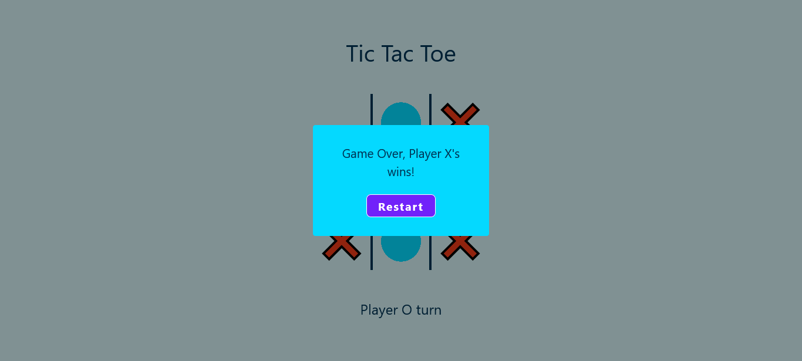

# Tic Tac Toe Game

Tic Tac Toe The Game practice with Javascript.

note: Responsive only tested on mobile `(max-width: 600px)` and laptop `(max-width: 1360px)` using Firefox Browser. Above `(width: 1360px)` I am not sure if it still good or maybe it will broke.

## Overview

### Screenshot

## My process

### Built with

- HTML5
- CSS3
- Flexbox and Grid
- Mobile-first Responsive Design
- Bootstrap
- Javascript
- [SASS](https://sass-lang.com/)

### What I learned

- Spread Operator
- `.every()`
- `.some()`
- `.removeEventListener()`

## Contact

- [Linkedin](https://id.linkedin.com/in/dyota-samudriawan)
- Github - [@samudriawan](https://github.com/samudriawan/)
- Twitter - [@samudriawan](https://twitter.com/samudriawan)
- Frontend Mentor - [@samudriawan](https://www.frontendmentor.io/profile/samudriawan)
